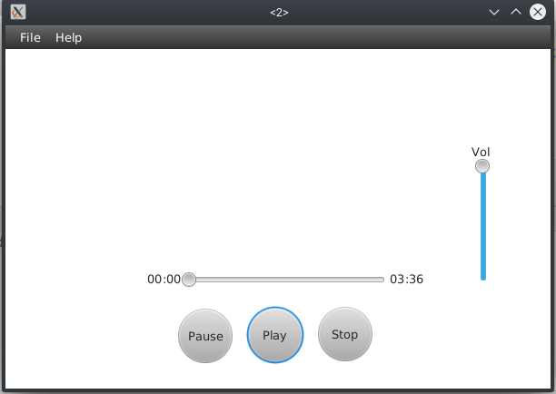

# StupidMusicPlayer

A barebones barely working music player built using JavaFX. 

**PS:** This code won't be really helpful, reusable or maintainable. This is not production ready code but more of a joke.

There **will be** some issues for Linux users as JavaFX doesn't support libavcodec version >= 58

## Requirements
Requires a Java version >= 11 preferably the latest.

## Formats supported
mp3*, m4a*, wav, aac*, aiff, m3u8

## Screenshots

